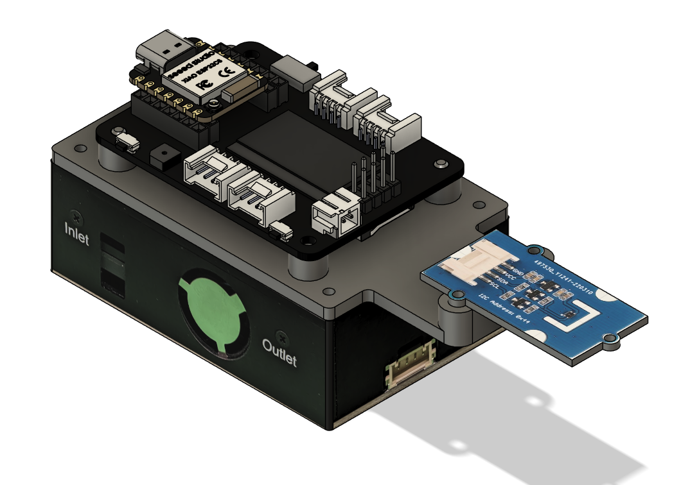
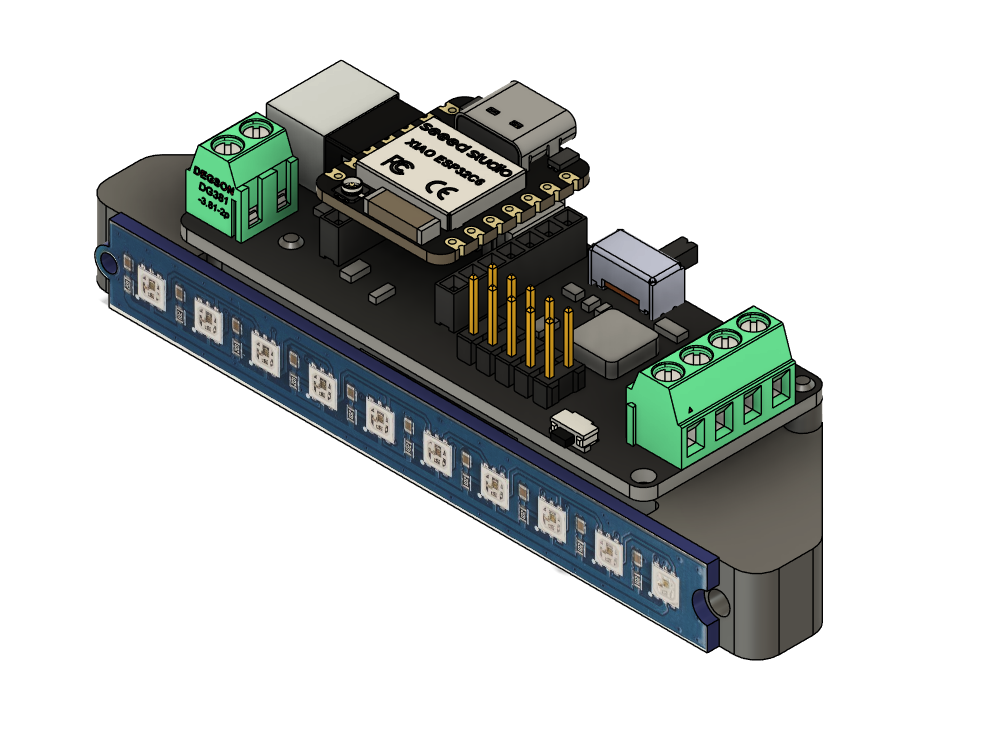

# Enclosures

Minimal 3D-printable mounts for the two devices. The goal is simply to keep the
PCBs from lying around loose and to hold the stack together. They are not meant to
be pretty or sturdy, just simple. Each `.3mf` is print-ready, and the `.png` next
to it is a render of the assembled result.

| Device                       | Model                                      | Render                                    |
| ---------------------------- | ------------------------------------------ | ----------------------------------------- |
| [`sensor`](../sensor.yaml)   | [`sensor-minimal.3mf`](sensor-minimal.3mf) |              |
| [`ledbar`](../ledbar.yaml)   | [`ledbar-minimal.3mf`](ledbar-minimal.3mf) |              |

## sensor

Replaces the SEN55's top plate: the printed part drops straight onto the sensor
in place of the stock cover. It carries the rest of the stack on top.

- **XIAO distribution board**, mounted with **M3** screws.
- **SHT41** breakout, mounted with **M2** screws.

## ledbar

A flat carrier for the lightbar and its XIAO.

- **LED strip**, glued and screwed down (**M3 + M2**).
- **XIAO board**, held by double-sided tape only, no screws.
